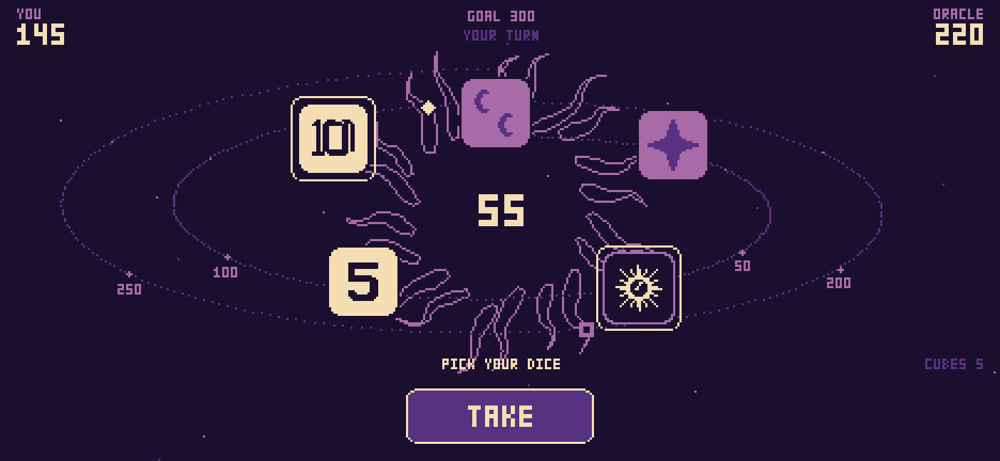

# Cosmic Wimpout

A pixel-art implementation of the 1976 push-your-luck dice game, played against
up to three opponents. No build step, no dependencies, no network — it runs from
a single HTML file and installs to an iPhone home screen.



## Play

Open `index.html`. That's it — the scripts are plain `<script>` tags rather than
ES modules specifically so `file://` works.

To install it on a phone you need it served over http, then use **Share → Add to
Home Screen**:

```bash
python3 -m http.server 8123
```

### Controls

Touch: tap a cube to keep it, tap the buttons to roll, take and bank.

Keyboard: `SPACE` roll / take · `B` bank · `1`–`5` pick a cube · `P` palette ·
`M` mute.

## Opponents

Pick one to three. They differ in temperament rather than skill, and the numbers
below are measured over 40,000 turns each, not guessed:

| | Habit | Bust rate | Points per turn |
| --- | --- | --- | --- |
| **ORACLE** | Plays the odds straight | 34% | 26.8 |
| **HERMIT** | Banks early and often | 24% | 24.4 |
| **COMET** | Chases everything | 51% | 25.8 |

Near-identical yield, very different shape. There is a ceiling on how far any of
them can diverge, and it belongs to the game rather than the code: 68% of all
throws are *forced* by the rules, and 65% of all busts happen on one.

## The Guiding Light

The printed rules end with an invitation: *any new rule may be added at any time
provided all players agree.* Switch it on before a game and one extra rule is
drawn at random and announced at the start.

| Rule | Effect |
| --- | --- |
| **COSMIC SAMPLER** | Five different faces score 25 |
| **FULL HOUSE** | A flash with a pair alongside scores double |
| **HALF MOONS RISE** | Half moons score 5 each |
| **THE SUN RIDES** | The Sun may complete a Freight Train |
| **THE SUN BETRAYS** | The Sun matches your flash face while clearing |
| **CLEAN SWEEP** | Matching a flash face re-throws the whole batch |
| **STEEP ASCENT** | You need 70 to get on the board |
| **MERCY** | Your first wimpout each game is forgiven |

Five of these are not inventions: they are the printed rules' genuine
ambiguities (see [RULES.md](RULES.md) §5) read the other way, which is why they
feel like the game rather than bolted onto it. Every variant lives as data in
`BASE_MODS`, so the engine stays one code path instead of growing a branch per
rule. Play to 300, 500 or 1000.

The opponents adapt: rather than assume the printed odds, they **measure the
rules actually in play** at the start of each game. Under HALF MOONS RISE the
true five-cube bust rate is 0.8% against the printed game's 5.8%, and an
opponent working from the wrong number plays as if in danger while nearly safe.

## It remembers

The match is written to `localStorage` as you play and picked back up on a cold
start, because a phone will interrupt you and losing a game 200 points into a
race is the difference between a page and an app. Lifetime records — best turn,
biggest flash, Freight Trains, Supernovas survived — live under RECORDS.

## Learning it

Hints explain each rule at the moment the game first applies it — no scripted
tutorial and no rigged dice. Each fires once ever and is remembered between
sessions. Toggle or reset them from the main menu.

## The game in one minute

Roll five cubes. Only **5s** and **10s** score on their own. Three matching faces
in one throw is a **Flash**, worth ten times the face value; five matching is a
**Freight Train**, worth a hundred times — five stars wins the game outright,
five tens is a **Supernova** and you are eliminated on the spot.

Roll nothing scoring and you **Wimpout**: the turn ends and everything you
accumulated this turn is gone. Banked points are never lost.

Three rules take away your choice to stop, and they are what make the game:

- **35 to get on the board.** The best non-flash roll is 30, so the threshold sits
  deliberately out of reach without a flash or a lucky sequence.
- **The Futtless Rule.** After a flash you *must* keep rolling to clear it.
- **You May Not Want To But You Must.** Score with all five cubes and you pick all
  five back up.

The printed rules are genuinely ambiguous in seven places. Every ruling this
implementation makes is catalogued in **[RULES.md](RULES.md)** with the reasoning,
and each is isolated in the engine so it can be flipped.

## Layout

| Path | Role |
| --- | --- |
| `src/engine.js` | Rules. Pure state machine, no rendering, no DOM. |
| `src/ai.js` | Opponents. Calibrates its risk table to whatever rules are in play. |
| `src/art.js` | Palette, 3×5 font, die faces, Sun-Star corona, audio. |
| `src/render.js` | Board drawing. Reads state, writes pixels, owns no logic. |
| `src/ui.js` | Shared button widget and text wrapper. |
| `src/scenes.js` | Scene registry. |
| `src/scene-*.js` | Menu, opponent setup, rules, and the match itself. |
| `src/hints.js` | Contextual rule hints and what has been seen. |
| `src/save.js` | Match persistence across app close. |
| `src/stats.js` | Lifetime records. |
| `src/fanfare.js` | Full-screen moments for trains, wins and Supernovas. |
| `src/audio.js` | Ambient drone and star sparkles under the menus. |
| `src/game.js` | Shell: canvas, scaling, loop, input routing. |
| `sim/` | Monte Carlo analysis and its PDF report. |
| `tools/icon.html` | Generates the app icons from the in-game Sun-Star. |

The separation between `engine.js` and `render.js` is load-bearing: it is what
made the move to a phone layout a re-layout rather than a rewrite, and it is what
lets the simulation drive the real rules rather than a copy of them.

## The simulation

`sim/flash_chain.py` is the Monte Carlo study behind the tuning. It produced the
opponent's risk table and settled whether a "flash chaining" mechanic could carry
a roguelike (it cannot — chains are structurally capped at depth 2).

```bash
python3 sim/flash_chain.py -n 120000 --json sim/out/results.json
python3 sim/make_report.py          # -> sim/out/cosmic-wimpout-analysis.pdf
```

Its most useful result was catching a rule both it and the engine had wrong: the
**Reroll Clause re-throws, it does not bust**. Correcting it moved the worst case
from a 72% bust rate to 44%, and inverted a conclusion — flashing a face that
*doesn't* score turns out to be protective, because every time you roll it you get
a free re-throw instead of losing the turn.

Pass `--legacy` to reproduce the incorrect model for comparison.

## Rendering notes

Four colours, 384×216 logical, every pixel drawn individually. Logical **height**
is fixed so type and cube size are identical everywhere; logical **width** is
derived from the viewport aspect, so an iPhone fills edge to edge in landscape
(≈468×216) while desktop keeps whole-pixel scaling.

Integer-only scaling was the original approach and had to go: `floor(393/384)` is
**1**, so a phone would have rendered the game postage-stamp sized in a corner.

## Development

**Bump `?v=N` in `index.html` and `CACHE` in `sw.js` together on every ship.**
The service worker is cache-first, so without it an installed phone will keep
running old code indefinitely. Worse during development: the browser serves the
stale file and a working change looks broken. Use the script rather than doing
it by hand — that mistake has cost three debugging detours already:

```bash
tools/bump.sh
```

## Credits

Cosmic Wimpout was designed by the Cosmic Wimpout Clubhouse (C3, Inc.) around
1975–76 and is still sold at [cosmicwimpout.com](https://cosmicwimpout.com). The
name and the cube designs are theirs; this is an independent implementation of the
published rules, written for fun and not for distribution.
