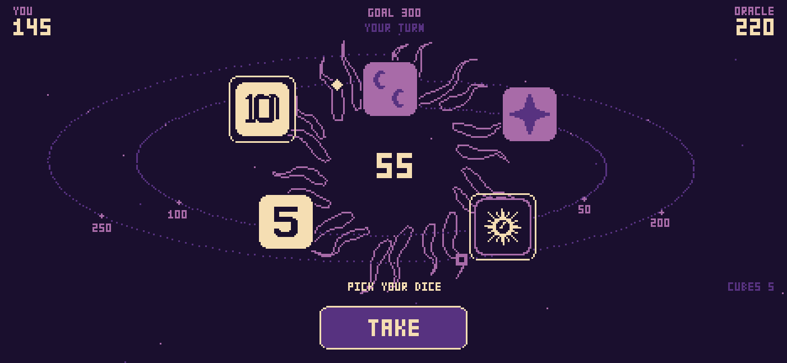
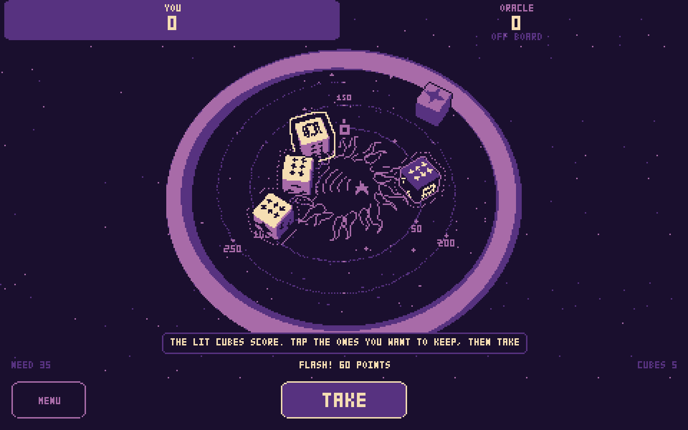

# Cosmic Wimpout

A pixel-art implementation of the 1976 push-your-luck dice game, played against
up to three opponents. No build step, no dependencies, no network — it runs from
a single HTML file and installs to an iPhone home screen.



## Play

**[432meadow.github.io/cosmic-wimpout](https://432meadow.github.io/cosmic-wimpout/)**

On iPhone, open that in Safari and use **Share -> Add to Home Screen**. It
installs as a landscape app and runs offline afterwards. Rotate the phone: iOS
ignores the manifest's orientation hint.

Or run it locally -- open `index.html`. That's it — the scripts are plain `<script>` tags rather than
ES modules specifically so `file://` works.

To install it on a phone you need it served over http, then use **Share → Add to
Home Screen**:

```bash
python3 -m http.server 8123
```

### Controls

Touch: tap a cube to keep it, tap the buttons to roll, take and bank.

Keyboard: `SPACE` roll / take · `B` bank · `1`–`5` pick a cube · `P` palette ·
`M` mute.

**No sound on iPhone?** Check the ringer switch first. Safari plays Web Audio
through the ringer channel, so the hardware mute switch silences the game and no
web page can override that. The menu's SOUND button reports what the browser
itself is doing: `SOUND ON` means the audio output is open, so if you still hear
nothing it is the switch.

## Cosmic Wimpout 2.0 — the 3D table



**Try it: [432meadow.github.io/cosmic-wimpout-2/v2/](https://432meadow.github.io/cosmic-wimpout-2/v2/)**
— a separate site for testing and sharing 2.0 while it is in progress; the
1.0 link above is unaffected.

`v2/` is the same game with the cubes thrown for real: stiff cubes simulated
on a table and rendered with raw WebGPU (WGSL, no engine) — and drawn in
1.0's look. Open `v2/index.html` over http(s) or localhost.

It fills the window: 1.0's scale (whole pixels on desktop, as large as fits
on touch), but rather than letterbox, the pixel canvas grows to cover the
screen. 1.0's menus sit centred in it; in play its chips run along the top
edge, its message and buttons along the bottom, and the table fills the
rest. Held upright, a phone gets a 240-wide canvas -- pixels about as big as
1.0's held sideways -- and every screen lays itself out tall: stacked menu
buttons and opponent cards, and in play the table right under the scores
with large buttons directly beneath it. Drag the table to spin it round or tip it, pinch or scroll to zoom; a
tap still keeps a cube and the buttons still answer at once, as in 1.0.

It is 1.0 in everything but the table. The menu, opponent setup, rules,
records, buttons, 3×5 font, hints, fanfare, Blips and the ambient bed are
1.0's own files, loaded unchanged; so are the rules, the opponents and the
save format (2.0 keeps its match in its own slot). The only new scene is
play, and even its chips, status line, message, buttons and game-over panel
are 1.0's, exported from `src/render.js`.

The table is rendered at 1.0's logical resolution — 216 rows, width from the
screen — and reduced to the live four-colour palette, so a cube is the same
few dozen pixels as on 1.0's board and `P` recolours the table with
everything else. The cubes carry 1.0's 24×24 face sprites texel for texel,
light commons with void symbols and the black Sun Cube with a lit edge;
held and flash cubes get 1.0's solid and dotted rings, and cubes that cannot
score dim as 1.0 dims them. The cloth is 1.0's board — the Sun-Star corona,
the elliptical spiral score track, the turn score in the sun's heart —
painted with 1.0's primitives at the size it appears on screen, on a large
round tray.

A throw is physical: the cubes are tossed from your side of the table,
whichever way you have turned it; they bounce and tumble, and when
everything has come to rest each top face is read and fed to the engine as
its dice draws. A cube left leaning on another is nudged, twice at most,
before it is read. Tap a lit cube to keep it, as in 1.0; the keys are 1.0's.
Without WebGPU, a card in 1.0's type says why and offers 1.0 itself.

| Path | Role |
| --- | --- |
| `v2/src/softbody.js` | The cubes: an XPBD lattice held stiff by whole-cube shape matching, landings answered with a rigid impact impulse, contacts, sleep. Pure; runs under Node. |
| `v2/src/table.js` | The five cubes: throw, settle, read, nudge, set aside. |
| `v2/src/scene-play.js` | 1.0's play scene on the 3D table. |
| `v2/src/renderer.js`, `shaders.js` | WebGPU: skinning, shadow map, the scene in tone/object/depth, then palette, dither, cube edges and rings. |
| `v2/src/sprites.js` | 1.0's face sprites as an atlas; 1.0's board painted as the cloth. |
| `v2/src/camera.js`, `mesh.js` | The orbit camera, fitted to 1.0's layout; cube and tray geometry. |
| `v2/src/game.js`, `scene-nogpu.js` | The full-window shell (1.0's, with a WebGPU canvas underneath, and the table's gestures) and the no-WebGPU card. |
| `v2/test/check.js` | Headless physics checks (`node v2/test/check.js`). |

## Opponents

Pick one to three. They differ in temperament rather than skill, and the numbers
below are measured over 40,000 turns each, not guessed:

| | Habit | Bust rate | Points per turn |
| --- | --- | --- | --- |
| **ORACLE** | Plays the odds straight | 34% | 26.8 |
| **HERMIT** | Banks early and often | 24% | 24.4 |
| **COMET** | Chases everything | 51% | 25.8 |

Near-identical yield, very different shape. There is a ceiling on how far any of
them can diverge, and it belongs to the game rather than the code: 68% of all
throws are *forced* by the rules, and 65% of all busts happen on one.

## The Guiding Light

The printed rules end with an invitation: *any new rule may be added at any time
provided all players agree.* Switch it on before a game and one extra rule is
drawn at random and announced at the start.

| Rule | Effect |
| --- | --- |
| **COSMIC SAMPLER** | Five different faces score 25 |
| **FULL HOUSE** | A flash with a pair alongside scores double |
| **HALF MOONS RISE** | Half moons score 5 each |
| **THE SUN RIDES** | The Sun may complete a Freight Train |
| **THE SUN BETRAYS** | The Sun matches your flash face while clearing |
| **CLEAN SWEEP** | Matching a flash face re-throws the whole batch |
| **STEEP ASCENT** | You need 70 to get on the board |
| **MERCY** | Your first wimpout each game is forgiven |

Five of these are not inventions: they are the printed rules' genuine
ambiguities (see [RULES.md](RULES.md) §5) read the other way, which is why they
feel like the game rather than bolted onto it. Every variant lives as data in
`BASE_MODS`, so the engine stays one code path instead of growing a branch per
rule. Play to 300, 500 or 1000.

The opponents adapt: rather than assume the printed odds, they **measure the
rules actually in play** at the start of each game. Under HALF MOONS RISE the
true five-cube bust rate is 0.8% against the printed game's 5.8%, and an
opponent working from the wrong number plays as if in danger while nearly safe.

## It remembers

The match is written to `localStorage` as you play and picked back up on a cold
start, because a phone will interrupt you and losing a game 200 points into a
race is the difference between a page and an app. Lifetime records — best turn,
biggest flash, Freight Trains, Supernovas survived — live under RECORDS.

## Learning it

Hints explain each rule at the moment the game first applies it — no scripted
tutorial and no rigged dice. Each fires once ever and is remembered between
sessions. Toggle or reset them from the main menu.

## The game in one minute

Roll five cubes. Only **5s** and **10s** score on their own. Three matching faces
in one throw is a **Flash**, worth ten times the face value; five matching is a
**Freight Train**, worth a hundred times — five stars wins the game outright,
five tens is a **Supernova** and you are eliminated on the spot.

Roll nothing scoring and you **Wimpout**: the turn ends and everything you
accumulated this turn is gone. Banked points are never lost.

Three rules take away your choice to stop, and they are what make the game:

- **35 to get on the board.** The best non-flash roll is 30, so the threshold sits
  deliberately out of reach without a flash or a lucky sequence.
- **The Futtless Rule.** After a flash you *must* keep rolling to clear it.
- **You May Not Want To But You Must.** Score with all five cubes and you pick all
  five back up.

The printed rules are genuinely ambiguous in seven places. Every ruling this
implementation makes is catalogued in **[RULES.md](RULES.md)** with the reasoning,
and each is isolated in the engine so it can be flipped.

## Layout

| Path | Role |
| --- | --- |
| `src/engine.js` | Rules. Pure state machine, no rendering, no DOM. |
| `src/ai.js` | Opponents. Calibrates its risk table to whatever rules are in play. |
| `src/art.js` | Palette, 3×5 font, die faces, Sun-Star corona, audio. |
| `src/render.js` | Board drawing. Reads state, writes pixels, owns no logic. |
| `src/ui.js` | Shared button widget and text wrapper. |
| `src/scenes.js` | Scene registry. |
| `src/scene-*.js` | Menu, opponent setup, rules, and the match itself. |
| `src/hints.js` | Contextual rule hints and what has been seen. |
| `src/save.js` | Match persistence across app close. |
| `src/stats.js` | Lifetime records. |
| `src/fanfare.js` | Full-screen moments for trains, wins and Supernovas. |
| `src/audio.js` | Ambient drone and star sparkles under the menus. |
| `src/game.js` | Shell: canvas, scaling, loop, input routing. |
| `sim/` | Monte Carlo analysis. Generates the PDF report; not checked in. |
| `tools/make-icons.py` | Writes the app icons from the in-game Sun-Star. |

The separation between `engine.js` and `render.js` is load-bearing: it is what
made the move to a phone layout a re-layout rather than a rewrite, and it is what
lets the simulation drive the real rules rather than a copy of them.

## The simulation

`sim/flash_chain.py` is the Monte Carlo study behind the tuning. It produced the
opponent's risk table and settled whether a "flash chaining" mechanic could carry
a roguelike (it cannot — chains are structurally capped at depth 2).

```bash
python3 sim/flash_chain.py -n 120000 --json sim/out/results.json
python3 sim/make_report.py          # -> sim/out/cosmic-wimpout-analysis.pdf
```

The measurements (`sim/out/results.json`, `report.txt`) are checked in; the PDF
is a build product and is not.

Its most useful result was catching a rule both it and the engine had wrong: the
**Reroll Clause re-throws, it does not bust**. Correcting it moved the worst case
from a 72% bust rate to 44%, and inverted a conclusion — flashing a face that
*doesn't* score turns out to be protective, because every time you roll it you get
a free re-throw instead of losing the turn.

Pass `--legacy` to reproduce the incorrect model for comparison.

## Rendering notes

Four colours, 384×216 logical, every pixel drawn individually. Logical **height**
is fixed so type and cube size are identical everywhere; logical **width** is
derived from the viewport aspect, so an iPhone fills edge to edge in landscape
(≈468×216) while desktop keeps whole-pixel scaling.

Integer-only scaling was the original approach and had to go: `floor(393/384)` is
**1**, so a phone would have rendered the game postage-stamp sized in a corner.

## Development

Icons are generated, not hand-drawn:

```bash
python3 tools/make-icons.py
```

It reads the Sun-Star sprite and the palette straight out of `src/art.js`, so the
icon cannot drift from the game, and writes the PNGs directly. An earlier version
screenshotted a page in headless Chrome and produced silently broken output --
Chrome clamps to a minimum window size, so the 180 and 192 icons were cropped
corners of the artwork rather than the icon.

**Bump `?v=N` in `index.html` and `CACHE` in `sw.js` together on every ship.**
The service worker is cache-first, so without it an installed phone will keep
running old code indefinitely. Worse during development: the browser serves the
stale file and a working change looks broken. Use the script rather than doing
it by hand — that mistake has cost three debugging detours already:

```bash
tools/bump.sh
```

## Credits

Cosmic Wimpout was designed by the Cosmic Wimpout Clubhouse (C3, Inc.) around
1975–76 and is still sold at [cosmicwimpout.com](https://cosmicwimpout.com). The
name and the cube designs are theirs; this is an independent implementation of the
published rules, written for fun and not for distribution.
